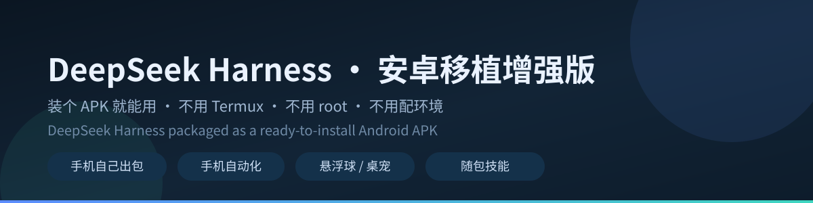

# DeepSeek Harness · 安卓移植增强版

<div align="center">



**中文** | [English](README.en.md)

<br>

[](https://github.com/guzhou079-arch/deepseek-harness-android/stargazers)
[](https://github.com/guzhou079-arch/deepseek-harness-android/releases/latest)

[](https://github.com/guzhou079-arch/deepseek-harness-android/commits/main)

</div>


把 **DeepSeek Harness**（DeepSeek 的 AI Agent）打包成**装个 APK 就能用**的安卓版。

**不用 Termux、不用 root、不用配环境** —— 终端、文件访问、命令执行全部在 App 内运行。

> **English** — DeepSeek Harness packaged as a ready-to-install Android APK. No Termux, no root, no setup:
> the terminal, file access and command execution all run inside the app. It can even compile, package,
> sign and release itself — entirely on the phone, without a computer.

| 能干什么 | 说明 |
|---|---|
| 🐳 **悬浮球 / 桌宠** | 单击球就"说话"：台词 / 账户余额 / 今日已用 / 上一轮消耗 / 峰谷与预算提醒 |
| ☁️ **流体云回复卡** | AI 正在写的时候，屏幕顶部浮出胶囊；点开成卡片看正文，可手动上下翻 |
| 🎛️ **设置页内置控制台** | 原生控制台与网页设置页深度融合：引擎管理、救援模式、权限总览、插件开关、时光机备份 |
| 📱 **手机自动化** | 读屏、点击、输入、通知读取、定时任务、虚拟屏 |
| 🔧 **手机自己出包** | javac → dex → 打包 → 签名 → 发版，全程不需要电脑（构建环境 App 内按需下载） |
| 🧩 **全量随包技能** | 内置 11 款官方与实用生产力技能：架构图（`dsh-diagram`）/ PPT 生成（`dsh-slides`）/ 短视频分镜（`dsh-storyboard`）/ 记忆中枢（`dsh-memory-sync`）/ 文档批处理（`dsh-doc-tidy`）/ 时光机备份（`dsh-backup`）/ 本地 RAG 检索（`dsh-doc-search`）/ 手机自动化（`dsh-mobile`）/ 多模型会审（`dsh-review`）等 |

> ⭐ **如果它帮你省了时间，给个 Star 是最好的反馈** —— 也让我知道继续维护值不值得。
> 用着有问题、或者有想要的功能，欢迎开 [Issue](https://github.com/guzhou079-arch/deepseek-harness-android/issues)。

### 下载安装（三步）

1. 打开 **[Releases](https://github.com/guzhou079-arch/deepseek-harness-android/releases/latest)**，下载最新的 `DeepSeekHarness-vX.Y-dist.apk`（约 95 MB，Android 8.0 及以上）；
2. 安装后按首次引导给权限（无障碍、通知、悬浮窗等，可随时在系统设置里收回）；
3. 在设置页填入自己的模型 API Key 就能开聊 —— 不用装 Termux、不用 root、不用连电脑。

> 🌐 **国内直连 GitHub 打不开？** 每个 Release 说明的**第一条**就是**加速直链**
> （`ghproxy` 等镜像前缀 + 官方直链，哪个通用哪个）；也可以自己给官方直链加前缀：
> `https://ghproxy.net/` 、 `https://ghfast.top/` 、 `https://gh-proxy.com/`。

每个 Release 的说明里带该 APK 的 **SHA-256**，装前可以核对。

**文档**：[安装与系统要求](docs/安装与要求.md) · [权限与隐私](docs/权限与隐私.md) · [常见问题](docs/常见问题.md) · [升级与救援](docs/升级与救援.md) · [自建环境与出包](docs/自建环境与出包.md)

> ## ⚠️ 更新前必读 —— 只从本仓库 Releases 更新
>
> 本 App 用**本项目自己的钥匙**签名。安装**其它来源**的同名 App（官方原版 / 上游作者的包 /
> 别人转发的 APK）会因签名冲突**无法覆盖安装**；此时若选择「卸载重装」，
> **App 私有数据会全部清空**（会话历史、运行环境、配置；没做过备份的话通常找不回来）。
>
> 遇到 `INSTALL_FAILED_UPDATE_INCOMPATIBLE` 报错时：**不要卸载** —— 这个报错正是在保护你的数据。
> 升级前先备份：App 内「控制台 → 救援 → 导出全部数据」（开发者也可用 `selfbuild/scripts/backup-dshhome.sh`）。
>
> **完整说明与救援步骤 → [docs/升级与救援.md](docs/升级与救援.md)**

---

本发布包是 **DeepSeek Harness 的安卓移植与增强版**，由个人制作。
以下如实说明各部分来源。

## 一、我做了什么（相对上游的改动）

上游 `woaiys3/deepseek-harness-android-app` 提供的是**安卓壳骨架**（WebView + Service 结构、
payload 打包、权限引导）。在这个底子之上，本版本包含大量适配与增强：

### 1. 安卓适配补丁（25 条）

| 类别 | 内容 |
|---|---|
| 系统能力 | NFC 读卡 · 无障碍读屏/点击/截图 · 虚拟屏 · 通知读取 · 特权通道（Shizuku）|
| 引擎适配 | `bash-local` sandboxMode · `flock` 安卓回退 · `session-persistence` 硬链接绕行 |
| 安全加固 | 静态资源门禁 · 客户端路由鉴权 · update-check 门禁 · 局域网绑定显式开关 |
| 界面 | 账户 UI 解锁 · 自定义背景图 · 移动端布局改造 · 应用更新日志 |
| 登录 | 授权链接改由系统浏览器打开 · 登录完成后自动回到 App |

### 2. 可以在手机上自己出包

整条链路（proot + Alpine + OpenJDK 17 → javac → d8 → 重打包 → 签名）都跑在手机里，
不需要电脑。构建环境不进 APK，在「控制台 → 自建环境」里**按需下载**（约 193MB）。
怎么用、踩过哪些坑：[`docs/自建环境与出包.md`](docs/自建环境与出包.md)。

### 3. 自研插件与补丁

- `whale-shota` —— 皮肤 / 桌宠扩展
- `dsh-android-ui` —— 安卓界面适配
- 背景图补丁、账户 UI 补丁

## 二、来源与许可

### 1. 安卓壳骨架 — MIT

| 项 | 内容 |
|---|---|
| 项目 | **deepseek-harness-android-app** |
| 作者 | [woaiys3](https://github.com/woaiys3) |
| 仓库 | <https://github.com/woaiys3/deepseek-harness-android-app> |
| 许可证 | **MIT License**，Copyright (c) 2026 woaiys3 |

MIT 许可允许修改、分发与再发布，**要求保留版权声明与许可证文本**。

### 2. DSH 引擎内核 — 归 DeepSeek 所有

| 项 | 内容 |
|---|---|
| 项目 | **@deepseek-ai/dsh**（DeepSeek Harness）|
| 仓库 | <https://github.com/deepseek-ai/deepseek-harness> |
| 许可证 | **MIT License**（版权归 DeepSeek，许可证全文随包） |
| 说明 | 本包内含其构建产物；版权与许可归原作者，本项目不对其主张任何权利 |

### 3. 虚拟屏（vscreen）— LGPL-3.0

| 项 | 内容 |
|---|---|
| 项目 | **Operit** — Android AI Agent |
| 作者 | [AAswordman](https://github.com/AAswordman) |
| 仓库 | <https://github.com/AAswordman/Operit> |
| 许可证 | **GNU Lesser General Public License v3.0（LGPL-3.0）** |

虚拟屏功能的实现移植/对齐自 Operit 的 shower 模块。相关源文件**已带原始许可声明**，
许可证全文见 `licenses/lgpl-3.0.txt`（LGPL-3.0 以 GPL-3.0 为基础，故同时提供 `licenses/gpl-3.0.txt`）。

---

## 三、免责

- 使用本包产生的任何后果由使用者自行承担
- 如对合规性有疑问、或发现归属遗漏，欢迎提 Issue 讨论
- 本包不修改、不绕过任何付费机制

---

## 四、许可全文位置

```
LICENSE                     MIT（本项目）
licenses/lgpl-3.0.txt       LGPL-3.0（虚拟屏部分）
licenses/gpl-3.0.txt        GPL-3.0（LGPL-3.0 的基础）
THIRD_PARTY_NOTICES.md      第三方组件逐项声明
```
