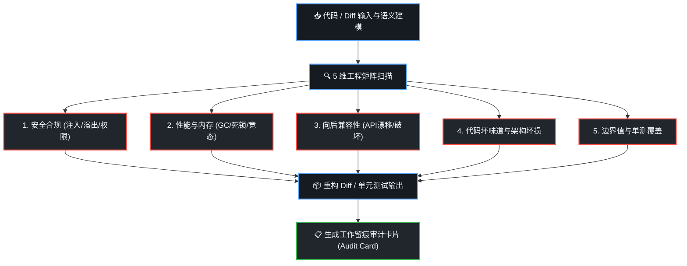

# 深度代码工程与架构评审技能 (dsh-code-craft)

当面对代码审查、系统重构、编写测试或排查深度缺陷时，本技能提供工业级、大厂标准的工程交付物，**严格执行可视化分析流程与工作留痕机制**。

---

## 🧭 可视化工作流程 (Visual Workflow)

每次执行代码审查或重构时，首先在回答中内联呈现标准推导流程：



---

## 🛠️ 核心交付规范

### 1. 5 维工业级 Code Review 评审单
必须对目标代码进行 5 大维度评定并给出打分（⭐ 1~5 分）与逐行风险定位：
- **安全与合规性**：有无 SQL/命令注入、反序列化、未授权访问、敏感信息泄漏；
- **并发与性能**：有无竞态条件 (Race Condition)、死锁风险、线程安全漏洞、CPU/内存暴涨或 GC 停顿；
- **架构与向后兼容**：接口变更是否破坏老版本客户端调用、有无违反开闭原则、模块强耦合；
- **代码整洁度与坏味道**：是否有超长方法、重复代码 (DRY)、魔法数字、反模式设计；
- **测试与可维护性**：异常分支是否可测、有无边界条件遗漏。

### 2. 生产级重构方案 (Refactor Diff)
- 使用标准 Unified Diff 格式清晰展示修改前后对比；
- 明确写出重构动机（提高内聚、消除副作用、降低圈复杂度）。

### 3. 全路径覆盖率单元测试 (Unit Tests)
- 覆盖 **正常路径 (Happy Path)**；
- 覆盖 **极端边界条件 (Edge Cases)**：`null`、空字符串、极大数值溢出、超时重试；
- 覆盖 **异常分支 (Exceptions)**：断言预期的异常抛出；
- 提供清晰的 Mock 数据与桩函数。

---

## 📋 必带工作留痕卡片 (Artifact Trace Card)

在每次交付物末尾，必须输出标准化的**工作留痕卡片**：

```markdown
---
### 📌 工作留痕审计卡片 (Code Craft Audit Card)
- **任务编号**：`CC-20261007-001`
- **审查对象**：`OrderPaymentService.java` (L45-L180)
- **风险评级**：`🟡 中危 (Medium Risk)`（发现 1 处并发幂等隐患，2 处异常未捕获）
- **主要决策**：
  1. 引入分布式锁/数据库乐观锁解决订单重复扣款风险；
  2. 提取公共校验逻辑至 `PaymentValidator` 消除重复代码；
  3. 补齐 5 组边界单测，分支覆盖率由 42% 提升至 95%。
- **生成时间**：2026-10-07 18:40 (DSH Code Craft Engine)
---
```
