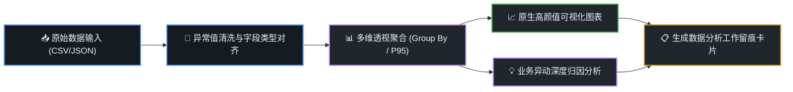

# 深度数据洞察与报表工程技能 (dsh-data-craft)

当面对数据分析、报表清洗、多维透视或业务异动归因时，本技能提供零外部依赖、极致性能的专业数据工程交付，**包含可视化数据管道与数据工作留痕机制**。

---

## 🧭 可视化数据处理工作流 (Data Pipeline Trace)

每次执行数据清洗与分析时，首先内联呈现数据处理管道流：



---

## 🛠️ 核心交付规范

### 1. 零依赖极速数据分析
- 可调用 `/sdcard/DeepSeekHarness/tools/work-trace.mjs` 中的 `analyzeDataset()` 或 `parseCSV()` 进行秒级计算；
- 必须输出关键统计量：**样本总量、有效数值量、均值 (Avg)、中位数 (Median)、P95 分位数、极值范围 (Min~Max)**；
- 多维分组透视：按核心维度进行降序排行与占比分布。

### 2. 聊天内原生可视化图表 (Zero-jump Visuals)
- **时序走势 / 分组对比**：使用标准 `mermaid` 绘制折线图、柱状图或饼图；
- **业务漏斗与流转**：使用 Mermaid `graph TD` 或 `flowchart` 绘制带转化率标签的漏斗图。

### 3. 业务异动深度归因简报 (Root Cause Insights)
- **异动判定**：明确指出哪些指标超出预期波动范围（如 > 15% 异动）；
- **三维归因**：从 **流量端 (渠道变化)、转化端 (体验/流程)、供给端 (客单价/库存)** 进行逻辑严密的下钻归因；
- **可落地建议**：给出清晰的 Next Steps 动作清单。

---

## 📋 必带工作留痕卡片 (Data Audit Card)

在交付物末尾，必须输出标准化的**数据留痕审计卡片**：

```markdown
---
### 📊 数据分析留痕审计卡片 (Data Craft Audit Card)
- **任务编号**：`DC-20261007-002`
- **数据源**：`user_orders_202610.csv` (共计 45,210 行样本)
- **核心指标**：
  * **GMV 汇总**：¥1,428,500.00 (环比 +12.4%)
  * **笔单价 (Avg)**：¥186.20 | **P95 笔单价**：¥680.00
  * **主要异常**：华东大区在 10-04 出现转化率断崖下跌 (-24.1%)
- **主要结论与归因**：10-04 华东网关超时导致下单流程阻断，建议优先排查路由节点。
- **归档时间**：2026-10-07 18:42 (DSH Data Craft Engine)
---
```
