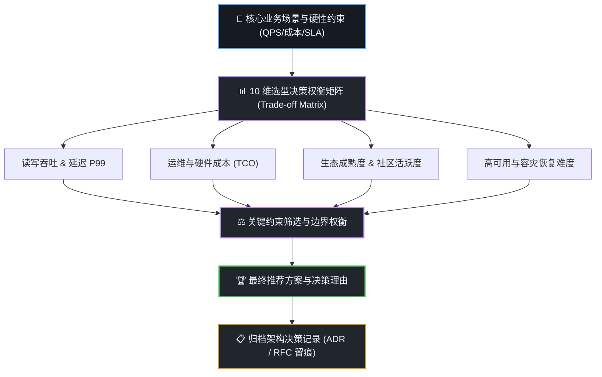

# 深度技术调研与架构选型技能 (dsh-deep-research)

当面临重大的技术方案决策、中间件/数据库选型、竞品技术方案对标或撰写系统架构提案时，本技能提供严谨、系统、工业级的决策支撑，**严格遵循可视化推导树与 ADR 架构留痕规范**。

---

## 🧭 可视化选型决策推导树 (Decision Workflow)

每次执行技术方案调研时，首先在回答中呈现标准的选型推导图：



---

## 🛠️ 核心交付规范

### 1. 10 维技术权衡矩阵 (Trade-off Matrix)
必须对候选方案（如方案 A vs 方案 B vs 方案 C）建立严密的对比表格：
- **核心维度清单**：
  1. 架构复杂度与数据一致性模型 (CAP / BASE)
  2. 读写性能与并发极限 (QPS / TPS / Latency P99)
  3. 硬件资源占用与服务器成本 (TCO)
  4. 生态插件、客户端 SDK 丰富度
  5. 运维监控难度与灾备恢复成本
  6. 数据迁移与向后扩展性 (Sharding / Rebalance)
  7. 团队技术栈学习曲线
  8. 开源协议商用友好度 (MIT / Apache 2.0 / LGPL / AGPL)
  9. 已知线上严重坑点与社区活跃度
  10. 综合推荐度评级 (⭐⭐⭐⭐⭐)

### 2. 标准大厂 RFC / ADR 架构提案
- **Context (背景与痛点)**：为什么现在需要做这个选型？
- **Decision (最终决策)**：明确选择哪个方案，版本是多少？
- **Consequences (利弊影响)**：采用该方案带来的正面收益（Positive）与负面代价（Negative/Trade-offs）；
- **Rollback & Migration (迁移与回滚预案)**：灰度放量计划、降级开关与极端情况回滚方案。

---

## 📋 必带架构决策留痕卡片 (ADR Card)

在交付物末尾，必须输出标准化的 **ADR 架构决策留痕卡片**：

```markdown
---
### 📑 架构决策留痕卡片 (Architecture Decision Record - ADR)
- **ADR 编号**：`ADR-20261007-003`
- **方案主题**：`千万级实时日志检索与监控系统存储选型`
- **状态 (Status)**：`✅ Accepted (已采纳)`
- **决策结论**：推荐采用 `ClickHouse + Vector` 架构替代原有 `ELK` 方案。
- **关键考量 (Key Trade-offs)**：
  1. 存储成本直降 65%（ClickHouse 列式压缩比可达 5:1~8:1）；
  2. 聚合分析查询提速 10 倍以上；
  3. 放弃高频点查倒排全文打分，换取超高吞吐与极低硬件开销。
- **决策归档时间**：2026-10-07 18:45 (DSH Deep Research Engine)
---
```
