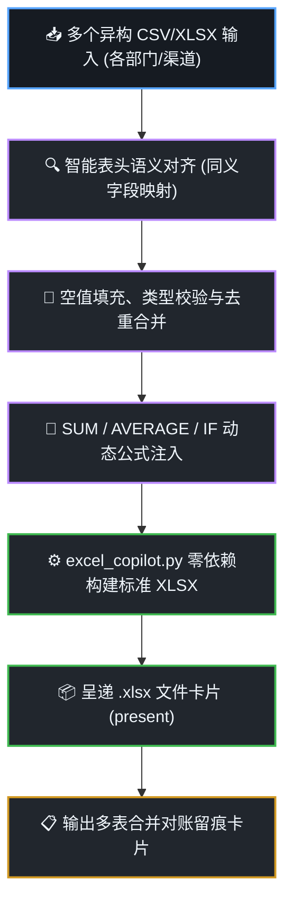

# Excel 多表对齐与公式自动化技能 (dsh-excel-copilot)

在手机端处理财务对账表、跨部门销售报表或异构数据汇总时，手机 WPS 手动复制粘贴、匹配字段和写公式极易出错。本技能提供**零依赖、自动化合并异构表格、自动注入 Excel 公式并生成大厂级高颜值 `.xlsx` 文件**的能力，**严格执行数据对齐工作流与对账留痕机制**。

---

## 🧭 可视化数据合并与对齐工作流 (Visual Excel Pipeline)

每次处理复杂表格合并与生成时，在回答中呈现标准的数据管道流：



---

## 🛠️ 核心交付规范

### 1. 多表智能对齐与清洗
- 自动识别异构表头同义词（如 `实收金额` ↔ `实付款` ↔ `成交额`）；
- 自动补齐缺失列，防止行错位；
- 统计清洗掉的空行与异常格式数量。

### 2. 标准 Excel 样式与公式规范
- **表头风格**：商务科技蓝底色 (`#0969DA`)、白色加粗字体、居中对齐；
- **自适应列宽**：根据内容长度设置合理列宽，杜绝文字截断或 `###` 显示；
- **原生公式注入**：汇总行必须使用标准 Excel 动态公式（如 `=SUM(D2:D50)`），而非写死静态数值。

### 3. 生成与呈递
调用 `/data/user/0/com.deepseek.harness/files/payload/dshhome/skills/dsh-excel-copilot/scripts/excel_copilot.py` 生成表格，并通过 `present` 工具将文件卡片直观呈递给用户。

---

## 📋 必带对账留痕审计卡片 (Excel Audit Card)

在交付物末尾，必须输出标准化的 **表格对账留痕卡片**：

```markdown
---
### 📊 表格合并与对账留痕卡片 (Excel Copilot Trace Card)
- **任务编号**：`XL-20261007-006`
- **源文件数**：`3 份异构表格`（华东/华北/华南销售对账表，共计 1,420 行记录）
- **字段对齐**：成功对齐 8 个维度字段，修正 12 处格式异常
- **公式注入**：注入 4 处 `SUM` 汇总公式与 2 处 `AVERAGE` 均值公式
- **输出文件**：`/sdcard/Download/DSH_WorkLogs/202610_全国销售汇总母表.xlsx`
- **交付动作**：已通过 `present` 呈递，支持在手机 WPS / 电脑 Excel 中原生查看与动态重新计算
- **审计时间**：2026-10-07 19:15 (DSH Excel Copilot Engine)
---
```
