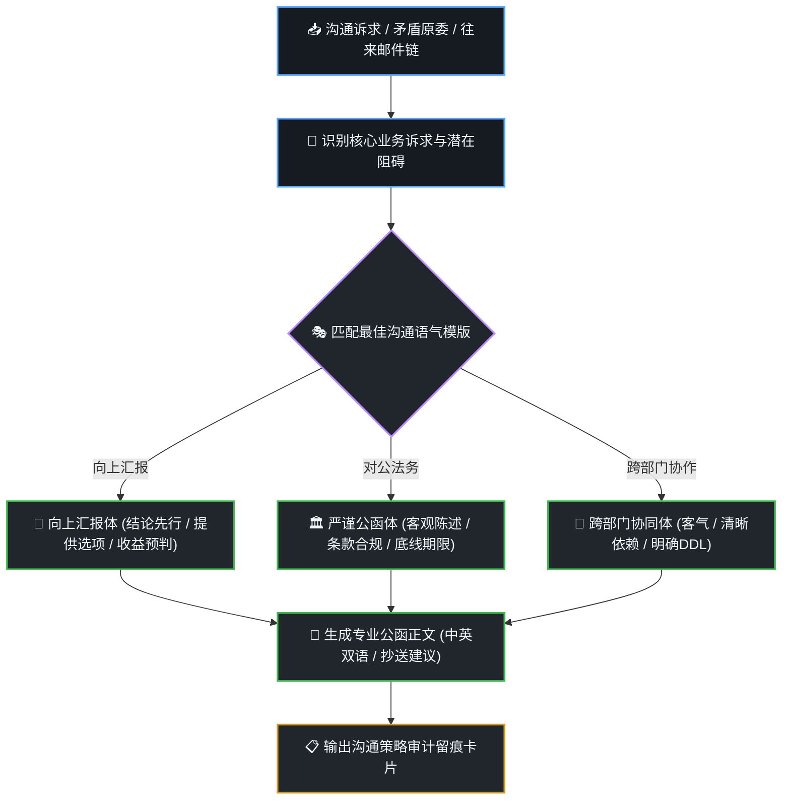

# 职场高情商沟通与对公公函技能 (dsh-mail-craft)

在职场中撰写向上汇报、跨部门催办、客户正式致歉或法务催款邮件时，措辞不当极易引发误解或激化矛盾。本技能提供**多重语气智能适配、结构化长邮件链复盘与大厂级公函润色**，**严格执行沟通策略时序流与沟通留痕机制**。

---

## 🧭 可视化沟通策略推导流 (Visual Mail Strategy)

每次拟定重要邮件或对公公函时，在回答中呈现沟通策略推导流：



---

## 🛠️ 核心交付规范

### 1. 三大经典职场语气模板 (Tone Presets)

- **👔 向上汇报体 (Upward Reporting)**
  - **原则**：结论先行 (Bottom-Line First) ➔ 业务价值与量化数据 ➔ 提供 2 个方案供领导做选择题 ➔ 预判风险与备用预案。
- **🏛️ 严谨法务公函体 (Formal Legal / Official)**
  - **原则**：严谨客观、依据合同编号与约定条款、陈述违约/延期事实、声明我方合法权利、明确最终补救截止时间与后果。
- **🤝 跨部门协同与催办体 (Cross-Team Collaboration)**
  - **原则**：先肯定前期协作成果 ➔ 阐明当前项目关键路径卡点 ➔ 明确对方需交付的具体物料与绝对 DDL ➔ 附带升级（Escalation）机制。

### 2. 交付物标准结构
- **邮件主题 (Subject)**：格式如 `【紧急请示/催办】关于 XX 项目核心接口排期确认 (需在 10-09 前反馈)`；
- **收件人 (To) & 抄送人 (CC) 建议**；
- **邮件正文 (Body)**：分段清晰、重点加粗；
- **备选方案与话术微调建议**。

---

## 📋 必带沟通留痕审计卡片 (Mail Audit Card)

在交付物末尾，必须输出标准化的 **沟通留痕卡片**：

```markdown
---
### ✉️ 职场沟通审计留痕卡片 (Mail Craft Trace Card)
- **任务编号**：`MC-20261007-007`
- **沟通对象**：`跨部门协作方 (支付网关研发团队负责人)`
- **采用语气**：`🤝 跨部门协同体 (清晰依赖 + 明确 DDL)`
- **核心诉求**：要求对方在周四 18:00 前完成接口变更与联调环境部署
- **风险预案**：若周四仍未交付，将协同双方部门总监进行项目排期优先级调整
- **审计时间**：2026-10-07 19:25 (DSH Mail Craft Engine)
---
```
