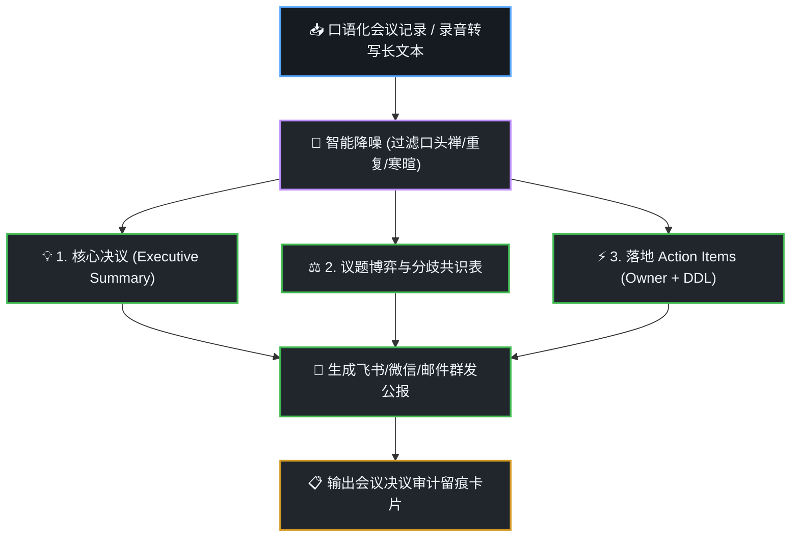

# 智能会议纪要与 Action Items 提取技能 (dsh-meeting-copilot)

在手机上查看冗长、充满口误和闲聊的会议录音转文字时，通读极其耗费时间且难以抓取决策焦点。本技能提供**口语化智能降噪、三层结构化提炼与闭环 Action Items 追踪**，**严格执行会议推进时序图与会议留痕机制**。

---

## 🧭 可视化会议推进时序流 (Visual Meeting Flow)

每次提炼会议纪要时，在回答中呈现标准的议程推进图：



---

## 🛠️ 核心交付规范

### 1. 三层金字塔结构化纪要
- **第 1 层：一句话核心决议 (Executive Summary)**
  - 用 1~2 句话高度概括本次会议达成的最关键成果或业务转向，杜绝空话。
- **第 2 层：核心议题与观点博弈表**
  - 列出讨论的核心矛盾点、各方代表观点（谁赞同/谁担忧）以及最终裁决理由。
- **第 3 层：落地待办闭环表 (Action Items)**
  - 严格包含 5 要素：**事项编号 | 具体任务 (动词开头) | 责任人 (Owner) | 截止时间 (DDL) | 交付物/验收标准**。

### 2. 跨平台群发通知模版
在正文末尾附带可一键复制至企微/飞书/钉钉群的精炼便签：
```text
📢 【会议决议公报】项目进度同步会 (2026-10-07)
━━━━━━━━━━━━━━━━━━━━
💡 一句话结论：
确认采用本地轻量 RAG 架构，全面暂停外部重型依赖采购。

⚡ 待办推进清单 (Action Items)：
  1. [张工] 输出接口文档与数据模型定义 (截止: 周三 18:00)
  2. [李工] 完成端侧索引压测与内存评估 (截止: 周五 12:00)
━━━━━━━━━━━━━━━━━━━━
```

---

## 📋 必带会议留痕审计卡片 (Meeting Audit Card)

在交付物末尾，必须输出标准化的 **会议决策留痕卡片**：

```markdown
---
### 🎙️ 会议决策审计留痕卡片 (Meeting Copilot Trace Card)
- **会议主题**：`《DSH 深度工作流与办公中枢方案评审会》`
- **参会人员**：`产品负责人、前端架构师、移动端负责人`
- **原始篇幅**：`降噪前 8,450 字 ➔ 降噪提炼后 620 字 (压缩率 92.6%)`
- **核心决议**：一致同意落地 4 大深度办公技能，放弃外部臃肿方案
- **待办数量**：共梳理出 4 项明确 Owner 与 DDL 的待办任务
- **审计时间**：2026-10-07 19:20 (DSH Meeting Copilot Engine)
---
```
