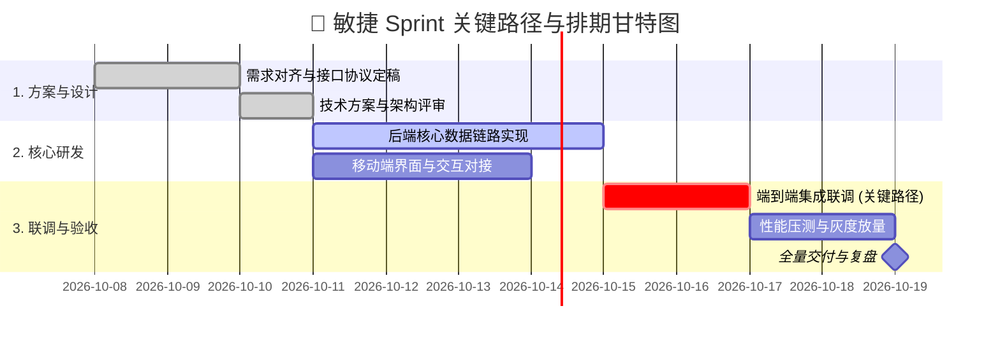

# 敏捷项目管理与排期工程技能 (dsh-scrum-master)

当面对复杂项目落地、大目标任务拆解、排期估时、风险把控或向上汇报进度时，本技能提供 PMP / 敏捷教练级别的专业支持，**严格执行可视化甘特图排期与项目工作留痕规范**。

---

## 🧭 可视化敏捷推进时序流 (Gantt Workflow)

每次执行项目拆解与排期规划时，首先在回答中内联呈现标准甘特图与关键路径：



---

## 🛠️ 核心交付规范

### 1. WBS 结构化任务拆解矩阵
必须将目标拆解为粒度在 0.5~2 人天（Man-Days）的标准任务卡片：
- **任务编号与名称**：如 `TASK-01: 支付幂等防重机制实现`；
- **估算工时**：明确人天（d）或故事点（Story Points）；
- **前置依赖 (Dependencies)**：明确该任务必须依赖哪几个任务先完成；
- **验收标准 (Definition of Done - DoD)**：明确通过哪些客观判据判定完成。

### 2. 关键路径分析 (Critical Path Analysis)
- 标出决定整个项目总工期的最长链路；
- 识别**非关键路径的任务浮动时间 (Slack Time)**，指出哪些任务有容错空间，哪些任务延误 1 天就会导致整个项目延期。

### 3. 项目风险雷达与预警 (Risk Matrix)
- 列出 Top 3 潜在风险（技术卡点、跨团队依赖、第三方接口变更）；
- 针对每个风险提供**缓解措施 (Mitigation Plan)** 与**备用预案 (Fallback)**。

---

## 📋 必带项目排期留痕卡片 (Project Trace Card)

在交付物末尾，必须输出标准化的 **项目排期审计卡片**：

```markdown
---
### 📋 敏捷项目排期留痕卡片 (Scrum Master Trace Card)
- **项目编号**：`PM-20261007-004`
- **项目名称**：`DSH 安卓端智能工作流全面升级`
- **总估算工时**：`14 人天 (Man-Days)` | **排期周期**：`2026-10-08 ~ 2026-10-24`
- **关键路径 (Critical Path)**：`架构设计 ➔ 核心数据链路 ➔ 端到端集成联调 ➔ 灰度放量`
- **当前健康度**：`🟢 正常 (On Track)`（无阻塞级风险）
- **归档时间**：2026-10-07 18:48 (DSH Scrum Master Engine)
---
```
